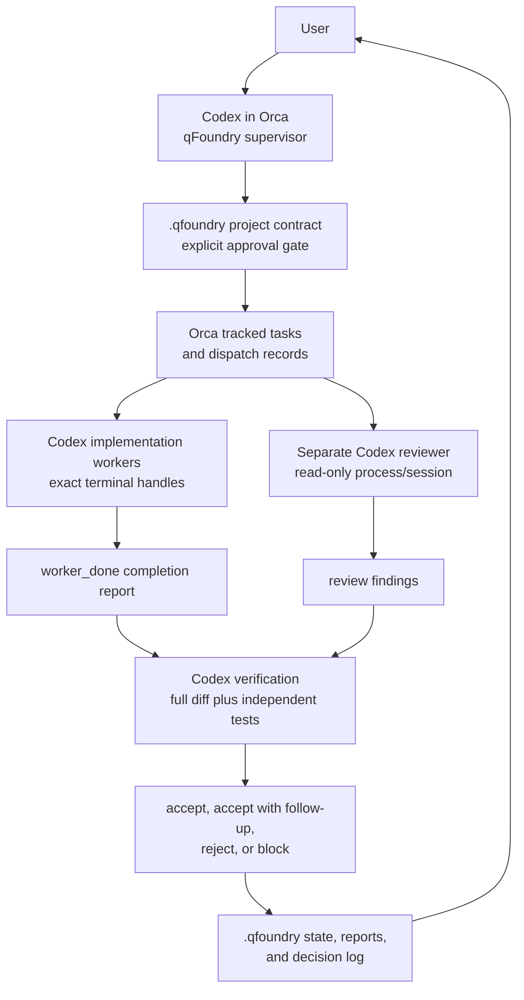

# qFoundry Supervisor

qFoundry Supervisor is a contract-first workflow for running supervised
multi-agent software development in Orca. Codex acts as the supervisor, creates
a project contract, decomposes the approved work into tracked Orca tasks,
dispatches workers, verifies their output independently, and records durable
state under `.qfoundry/`.

It is not a new dashboard, a replacement for Orca orchestration, a release
system, or an automatic merge bot. A worker completion message is evidence that
the worker stopped, not proof that the work is accepted.

## Architecture



## Why Codex Supervises First

Codex is the initial supervisor because it runs inside Orca with access to the
repository, Orca CLI, orchestration commands, Git state, tests, and local
reports. The supervisor role requires skepticism: inspect the diff, rerun tests,
reject incomplete work, and escalate decisions. That is separate from the worker
role.

## Codex-Only MVP Default

The supported MVP path is Codex-only:

- the user works with a Codex qFoundry supervisor;
- the controller creates or re-resolves separate Codex worker sessions;
- the reviewer is a separate read-only Codex process or Codex session;
- deterministic verification is run by qFoundry after `worker_done`.

Worker completion is not acceptance. A Codex worker can report completion only;
the supervisor/controller must still collect Git evidence, run deterministic
checks, invoke independent review when configured, and record an explicit
qFoundry verdict.

The controller keeps provider-neutral interfaces so future adapters can be
added, but Antigravity, Claude, or any other worker provider is not a
prerequisite for this MVP and is not the expected next step unless a separate
contract approves that integration.

## Prerequisites

- Orca installed or a local personal Orca/qFoundry repository running.
- Orca CLI available to the supervisor terminal.
- Orca orchestration enabled in Settings > Experimental.
- Scoped Codex worker profile configured for qFoundry projects.
- `orca-cli` and `orchestration` skills installed for the supervising agent.
- Codex CLI available for worker and reviewer processes.

## Install Skills

Install the base Orca skills:

```bash
npx skills add https://github.com/stablyai/orca --skill orca-cli --global
npx skills add https://github.com/stablyai/orca --skill orchestration --global
```

Install qFoundry Supervisor from your personal repository after it contains the
skill:

```bash
npx skills add https://github.com/YOUR_GITHUB_USERNAME/YOUR_ORCA_QFOUNDRY_REPO --skill qfoundry-supervisor --global
```

If you are installing from a feature branch before it is merged into your
personal repository's default branch, inspect `npx skills add --help` and use the
supported branch or local-path syntax. Do not overwrite established agent
configuration for a test; use an isolated target or dry-run if the installed
`skills` CLI supports one.

Restart the Codex supervisor after installation so the new skill is discovered.

## Running Official Orca Or The Personal Repo

For official Orca, install from the public release and confirm:

```bash
orca status --json
```

For a source checkout, follow the repository contributor guide. The current
repository expects Node 24 and pnpm. A development CLI may expose `orca-dev`
after the CLI build; use the command documented by the current source and CLI
help.

## First Project Prompt

```text
Use the qfoundry-supervisor skill to supervise this project.

Begin in discovery mode. Inspect the repository, but do not modify
implementation files or dispatch workers yet.

My initial project goal is:

[PROJECT GOAL]

Create a complete project contract with stable requirement and acceptance
criterion IDs. Present it for explicit approval before implementation.

After approval, create tracked Orca tasks and use no more than two Codex
implementation workers concurrently by default. Use exact terminal handles,
separate worktrees for overlapping repository work, and qFoundry acceptance
before releasing dependent tasks.

For every worker completion, inspect the full diff, independently run the
tests, compare the result to the approved contract, and either accept,
reject, or block it with evidence.

Do not merge, push project implementation, deploy, spend money, access
secrets, send external communications, or delete important data without
my explicit approval.
```

## Contract And Approval Workflow

1. The supervisor runs preflight and repository discovery.
2. The supervisor creates `.qfoundry/PROJECT_CONTRACT.md`.
3. Requirements use IDs such as `REQ-001`.
4. Acceptance criteria use IDs such as `AC-001`.
5. The user explicitly approves the contract.
6. The approval is recorded in the contract and `.qfoundry/DECISION_LOG.md`.
7. Only then does the supervisor create implementation tasks.

Use an Orca decision gate or ask/reply flow when available. Do not infer
approval from silence or from a request for a draft.

Contract approval is a mandatory dispatch precondition. No task may be
dispatched unless:

- contract status is exactly `approved`;
- approval is explicitly attributable to the user;
- a `DEC-*` decision record exists in `.qfoundry/DECISION_LOG.md`;
- any Orca approval gate created for the contract is resolved.

If any of those conditions is missing, do not dispatch. Record the missing
evidence and ask, escalate, or create a decision gate instead.

## Task And Dispatch Workflow

The supervisor creates tracked tasks:

```bash
orca orchestration task-create --spec "<task spec>" --json
orca orchestration task-list --json
```

Then the supervisor launches or selects a worker. For a separate worktree,
prefer agent-first creation when supported:

```bash
orca worktree create --name "<task-name>" --no-parent --agent qfoundry-codex-worker --json
```

Use the returned worktree ID and `startupTerminal.handle`. Wait for readiness:

```bash
orca terminal wait --terminal <handle> --for tui-idle --timeout-ms 60000 --json
```

Dispatch the tracked task:

```bash
orca orchestration dispatch --task <task_id> --to <handle> --inject --json
orca orchestration dispatch-show --task <task_id> --json
```

Wait for coordinator events with a bounded rolling interval:

```bash
orca orchestration check --wait
  --types worker_done,escalation,decision_gate
  --timeout-ms <bounded rolling interval>
  --json
```

Each timeout is a checkpoint, not failure. Before retrying or intervening,
inspect task status, dispatch status, heartbeat history, and terminal state.

If the installed CLI rejects agent-first worktree creation or `--inject`, follow
the current `orca-cli` and `orchestration` skill guidance and record the
limitation in `.qfoundry/PROJECT_STATE.md`.

## Phase 2A Controller

The additive Phase 2A sidecar lives at `tools/qfoundry-controller/`. It provides
an executable controller loop over the same qFoundry lifecycle without changing
Orca runtime or UI internals.

Use it when a project has an approved contract and a prepared
`.qfoundry/controller-state.json`:

```bash
node tools/qfoundry-controller/bin/qfoundry-controller.mjs run \
  --project /absolute/path/to/project \
  --state .qfoundry/controller-state.json \
  --provider codex \
  --max-workers 4 \
  --orca orca \
  --review-command qfoundry-codex-reviewer \
  --wait-timeout-ms 900000 \
  --max-correction-rounds 3
```

The controller:

- creates tracked Orca tasks and injected dispatches through JSON CLI calls;
- uses exact terminal handles, not `@codex` group routing;
- creates or re-resolves worker terminals itself instead of requiring the user
  to manually address each worker;
- defaults `maxConcurrentWorkers` to `2` and supports a tested target of `4`;
- dispatches only dependency-ready tasks and keeps dependent tasks blocked
  until prerequisite qFoundry acceptance;
- detects obvious file or subsystem collisions before concurrent dispatch;
- persists task, dispatch, worker, worktree, and repository mappings for
  restart recovery;
- applies bounded rate-limit backoff instead of creating duplicate agents;
- treats bounded wait timeouts as checkpoints;
- moves `worker_done` only to `worker_completed`;
- records dispatch baseline evidence: worker worktree, repository root, base
  SHA, branch, qFoundry task ID, Orca task ID, dispatch ID, and terminal handle;
- independently collects real Git status, committed/staged/tracked/untracked
  changes, changed files, diff stats, bounded textual diffs, and artifact
  hashes before review;
- runs structured verification commands without shell interpolation and records
  command, args, cwd, exit code, bounded output, duration, timestamp, and
  expected result;
- runs independent supervisor review before acceptance, using the bundled
  Codex reviewer launcher when configured;
- rejects malformed review JSON, reviewer timeout, missing Git evidence, missing
  verification, wrong-exit verification, timed-out verification, stale
  lifecycle messages, mismatched sender handles, and report path mismatches;
- creates fresh correction dispatches after rejection;
- blocks after the configured correction retry limit;
- persists pending user decisions and supports `status`, `decisions`,
  `answer`, and `resume` commands;
- persists progress under `.qfoundry/controller-state.json` so a restarted
  controller can continue from recorded evidence.

Bundled reviewer launcher:

```bash
node tools/qfoundry-controller/bin/qfoundry-codex-reviewer.mjs \
  --project /absolute/path/to/project \
  --timeout-ms 180000
```

It inspects the installed `codex exec --help`, uses read-only noninteractive
Codex execution, writes schema/output under `.qfoundry/reviewer-runs/`,
terminates the process tree on timeout, validates the JSON schema, and treats
source, diffs, reports, comments, terminal output, and artifacts as untrusted
evidence.

First-class decision commands:

```bash
node tools/qfoundry-controller/bin/qfoundry-controller.mjs status --project /absolute/path/to/project
node tools/qfoundry-controller/bin/qfoundry-controller.mjs decisions --project /absolute/path/to/project
node tools/qfoundry-controller/bin/qfoundry-controller.mjs answer --project /absolute/path/to/project --decision DEC-001 --answer "Use UTC."
node tools/qfoundry-controller/bin/qfoundry-controller.mjs resume --project /absolute/path/to/project
```

`answer` validates that the decision is still active, sends the Orca reply,
persists the answer, transitions the task from `blocked_pending_user_decision`
back to its active state, and resumes without creating a duplicate dispatch.

## Context Packets And Ownership

Each injected task dispatch includes a generated context packet with:

- task objective;
- requirement IDs and acceptance criterion IDs;
- relevant decisions;
- repository ID and assigned worktree;
- permitted subsystem or files;
- prohibited actions;
- required deterministic checks;
- expected completion report;
- dependency state;
- task and dispatch identities.

The controller records which worker owns which file or subsystem. Concurrent
dispatch is allowed only when the current task plan does not show an obvious
collision with active workers.

## Worker Completion

Workers must write a report and send exactly one `worker_done` from their own
terminal. The report includes task ID, dispatch ID, worker identity, verified
model when available, files changed, commands run, tests, assumptions,
deviations, unresolved issues, risks, and follow-up.

For long-running work, workers send heartbeat messages as requested by the
Orca dispatch preamble. Blocking questions go through `orca orchestration ask`.

Status mapping:

- Orca task status `completed` means Orca received a valid lifecycle completion
  signal; it maps only to qFoundry `worker_completed`.
- qFoundry `worker_completed` means the worker report and `worker_done` exist,
  but supervisor acceptance has not happened.
- qFoundry `under_verification` means the supervisor is independently checking
  files, diff, tests, requirements, and acceptance criteria.
- qFoundry `accepted`, `accepted_with_follow_up`, `rejected`,
  `blocked_pending_user_decision`, or `failed` is the supervisor verdict after
  verification or an explicit blocker. `accepted_with_follow_up` is allowed only
  when acceptance criteria passed and follow-up work is tracked separately.

## Verification And Rejection

After worker completion, qFoundry state moves to `under_verification`. The
supervisor reads the report, inspects every changed file, reviews the full diff,
runs relevant tests independently, checks the result against each requirement
and acceptance criterion, and writes a report under `.qfoundry/reports/`.

The report verdict is one of:

- `accepted`
- `accepted_with_follow_up`
- `rejected`
- `blocked_pending_user_decision`

Rejected work creates a correction task linked to the original task. The
supervisor does not silently edit rejected worker code unless the user assigns
implementation ownership to the supervisor.

## Recovery After Interruption

On restart:

1. Read `.qfoundry/PROJECT_CONTRACT.md`.
2. Read `.qfoundry/PROJECT_STATE.md`.
3. Read `.qfoundry/DECISION_LOG.md`.
4. Run `orca status --json`.
5. Run `orca orchestration task-list --json`.
6. Re-resolve terminals with `orca terminal list --json`.
7. Inspect active dispatches with `orca orchestration dispatch-show`.
8. Continue only from states with evidence.

Do not reset runtime-global orchestration state just to make the screen tidy.
Do not reuse stale terminal handles or dispatch IDs.

## Permission Policy

Green actions are safe for the supervisor: inspect files, inspect diffs, write
`.qfoundry/` state, create local branches/worktrees, and run local checks.

Yellow actions require contract-specific notification or approval: dependency
changes, CI changes, schema changes, build tooling changes, authentication
changes, broad refactors, and substantial paid API usage.

Red actions always require explicit user approval: merge, push project
implementation, publish a release, deploy, spend money, access secrets, send
external messages, delete valuable data, modify production, weaken tests, or
disable security controls.

## Controlled Smoke Test

Use a disposable repository, not an important project:

1. Create a small Git repo with one source file, one test, and a clean baseline
   commit.
2. Start or connect to Orca.
3. Confirm `orca status --json`.
4. Confirm orchestration is enabled.
5. Launch Codex as supervisor.
6. Install or load qFoundry Supervisor.
7. Draft and approve a small contract, for example CSV escaping behavior.
8. Create a tracked Orca task.
9. Launch Codex worker terminals through the qFoundry controller.
10. Record the selected worker profile mode and preflight evidence.
11. Dispatch with the current injected-dispatch mechanism.
12. Receive `worker_done`.
13. Inspect the diff and run tests independently.
14. Write `.qfoundry` state and a report.
15. Stop without merging or publishing.

End-to-end smoke-test evidence checklist:

- Codex supervisor session is running with `qfoundry-supervisor` loaded.
- Four distinct Codex worker terminals were created or re-resolved with exact
  handles.
- Four distinct tracked tasks and four distinct dispatches were observed
  without `@codex` group addressing.
- The selected Codex profile mode was recorded, including
  `windows-codex-compat` preflight evidence when used.
- A separate Codex reviewer process or session recorded its verdict.
- A tracked Orca task was created and an injected dispatch was observed.
- Coordinator waiting used `orca orchestration check --wait` for `worker_done`,
  `escalation`, and `decision_gate`.
- Valid `worker_done` came from the worker terminal for the expected task and
  dispatch.
- Supervisor captured real Git evidence and ran deterministic verification.
- A deliberate worker defect was introduced and supervisor rejection was
  recorded with evidence from the real Codex reviewer.
- A correction dispatch was created with a fresh dispatch ID and independently
  verified.
- Correction report recorded the new deterministic verification evidence.
- Restart and recovery continued from `.qfoundry` state without reusing stale
  handles or dispatch IDs.
- A real worker question created a pending decision, `decisions` listed it,
  `answer` resolved it, and `resume` continued the same task without duplicate
  dispatch.
- An unambiguous worker question was answered automatically from the approved
  contract.
- At least one dependent task became ready only after prerequisite qFoundry
  acceptance.
- Shared Codex-account concurrency, throttling, queuing, or absence of
  throttling was recorded. Any throttle response used bounded scheduler backoff
  and preserved existing live tasks.

Live smoke evidence is only valid when these items were actually observed. Do
not claim a live Codex-only four-worker smoke test from static checks alone.

If Codex auth, profile setup, account capacity, or Orca runtime state blocks
the smoke test, do not bypass account security and do not claim success. Record
the exact manual action needed and the command to resume.

## Known MVP Limitations

- qFoundry is an agent skill and documentation layer; it does not add a custom
  dashboard.
- Alternative worker providers are future adapters and are not part of the
  supported MVP default.
- `.qfoundry/` state is maintained by the supervisor, so accuracy depends on
  disciplined updates after each task transition.
- End-to-end worker dispatch requires a running Orca runtime with orchestration
  enabled and worker CLIs installed.

## Updating Your Personal Repo

If your personal repository tracks Orca upstream, inspect remotes before
pushing:

```bash
git remote -v
git fetch upstream
git switch main
git merge --ff-only upstream/main
git push origin main
```

Use `origin` only when it is your fork or personal qFoundry repository. If your
fork remote has another name, substitute that remote. Do not push to the remote
named `upstream` when it points at `stablyai/orca`.

If the personal repository default branch is not `main`, replace `main` with
that branch. To update a qFoundry feature branch before merging, fetch upstream
and rebase or merge deliberately:

```bash
git fetch upstream
git switch feat/qfoundry-supervisor-mvp
git rebase upstream/main
```

Resolve conflicts by preserving upstream Orca behavior and keeping qFoundry
logic isolated.

## Uninstalling

Inspect the installed `skills` CLI help:

```bash
npx skills --help
```

Use the supported remove or uninstall command for `qfoundry-supervisor`. Do not
delete unrelated skill directories manually unless you know the installed skill
root and have checked that only qFoundry files are affected.
