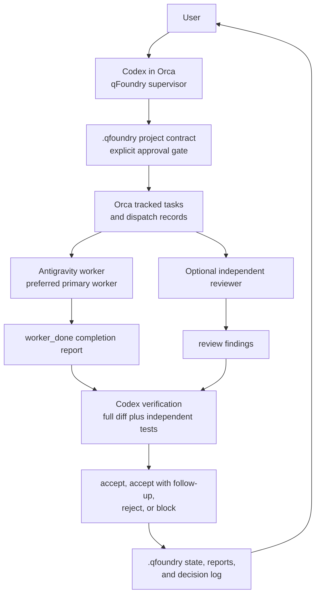

# qFoundry Supervisor

qFoundry Supervisor is a contract-first workflow for running supervised
multi-agent software development in Orca. Codex acts as the supervisor, creates
a project contract, decomposes the approved work into tracked Orca tasks,
dispatches workers, verifies their output independently, and records durable
state under `.qfoundry/`.

It is not a new dashboard, a replacement for Orca orchestration, a release
system, or an automatic merge bot. A worker completion message is evidence that
the worker stopped, not proof that the work is accepted.

## Architecture



## Why Codex Supervises First

Codex is the initial supervisor because it runs inside Orca with access to the
repository, Orca CLI, orchestration commands, Git state, tests, and local
reports. The supervisor role requires skepticism: inspect the diff, rerun tests,
reject incomplete work, and escalate decisions. That is separate from the worker
role.

## How Antigravity Is Used

Current Orca source identifies Antigravity as the TUI agent id `antigravity`,
detects and launches the `agy` command, and supports resume with
`agy --conversation <conversationId>` when hook data exposes a conversation ID.
The qFoundry skill requires the supervisor to reverify those facts against the
current source or installed CLI before dispatch.

Antigravity can be the primary worker when it is installed and ready. If the
active model can be verified as Claude, the supervisor may record that. If model
selection requires user action in the Antigravity UI, use a decision/manual gate
before dispatch. If active-model verification is impossible, record the model as
unverified.

## Prerequisites

- Orca installed or a local personal Orca/qFoundry repository running.
- Orca CLI available to the supervisor terminal.
- Orca orchestration enabled in Settings > Experimental.
- Agent permissions set to Manual for qFoundry projects.
- `orca-cli` and `orchestration` skills installed for the supervising agent.
- Antigravity installed and authenticated if it will be used as a worker.
- A visible or otherwise verifiable Antigravity model state if Claude
  attribution is required.

## Install Skills

Install the base Orca skills:

```bash
npx skills add https://github.com/stablyai/orca --skill orca-cli --global
npx skills add https://github.com/stablyai/orca --skill orchestration --global
```

Install qFoundry Supervisor from your personal repository after it contains the
skill:

```bash
npx skills add https://github.com/YOUR_GITHUB_USERNAME/YOUR_ORCA_QFOUNDRY_REPO --skill qfoundry-supervisor --global
```

If you are installing from a feature branch before it is merged into your
personal repository's default branch, inspect `npx skills add --help` and use the
supported branch or local-path syntax. Do not overwrite established agent
configuration for a test; use an isolated target or dry-run if the installed
`skills` CLI supports one.

Restart the Codex supervisor after installation so the new skill is discovered.

## Running Official Orca Or The Personal Repo

For official Orca, install from the public release and confirm:

```bash
orca status --json
```

For a source checkout, follow the repository contributor guide. The current
repository expects Node 24 and pnpm. A development CLI may expose `orca-dev`
after the CLI build; use the command documented by the current source and CLI
help.

## First Project Prompt

```text
Use the qfoundry-supervisor skill to supervise this project.

Begin in discovery mode. Inspect the repository, but do not modify
implementation files or dispatch workers yet.

My initial project goal is:

[PROJECT GOAL]

Create a complete project contract with stable requirement and acceptance
criterion IDs. Present it for explicit approval before implementation.

After approval, create tracked Orca tasks and use no more than two
implementation workers concurrently. Prefer Antigravity using a verified
Claude model as the primary implementation worker.

For every worker completion, inspect the full diff, independently run the
tests, compare the result to the approved contract, and either accept,
reject, or block it with evidence.

Do not merge, push project implementation, deploy, spend money, access
secrets, send external communications, or delete important data without
my explicit approval.
```

## Contract And Approval Workflow

1. The supervisor runs preflight and repository discovery.
2. The supervisor creates `.qfoundry/PROJECT_CONTRACT.md`.
3. Requirements use IDs such as `REQ-001`.
4. Acceptance criteria use IDs such as `AC-001`.
5. The user explicitly approves the contract.
6. The approval is recorded in the contract and `.qfoundry/DECISION_LOG.md`.
7. Only then does the supervisor create implementation tasks.

Use an Orca decision gate or ask/reply flow when available. Do not infer
approval from silence or from a request for a draft.

## Task And Dispatch Workflow

The supervisor creates tracked tasks:

```bash
orca orchestration task-create --spec "<task spec>" --json
orca orchestration task-list --json
```

Then the supervisor launches or selects a worker. For a separate worktree,
prefer agent-first creation when supported:

```bash
orca worktree create --name "<task-name>" --no-parent --agent antigravity --json
```

Use the returned worktree ID and `startupTerminal.handle`. Wait for readiness:

```bash
orca terminal wait --terminal <handle> --for tui-idle --timeout-ms 60000 --json
```

Dispatch the tracked task:

```bash
orca orchestration dispatch --task <task_id> --to <handle> --inject --json
orca orchestration dispatch-show --task <task_id> --json
```

If the installed CLI rejects agent-first worktree creation or `--inject`, follow
the current `orca-cli` and `orchestration` skill guidance and record the
limitation in `.qfoundry/PROJECT_STATE.md`.

## Worker Completion

Workers must write a report and send exactly one `worker_done` from their own
terminal. The report includes task ID, dispatch ID, worker identity, verified
model when available, files changed, commands run, tests, assumptions,
deviations, unresolved issues, risks, and follow-up.

For long-running work, workers send heartbeat messages as requested by the
Orca dispatch preamble. Blocking questions go through `orca orchestration ask`.

## Verification And Rejection

After worker completion, qFoundry state moves to `under_verification`. The
supervisor reads the report, inspects every changed file, reviews the full diff,
runs relevant tests independently, checks the result against each requirement
and acceptance criterion, and writes a report under `.qfoundry/reports/`.

The report verdict is one of:

- `accepted`
- `accepted_with_follow_up`
- `rejected`
- `blocked_pending_user_decision`

Rejected work creates a correction task linked to the original task. The
supervisor does not silently edit rejected worker code unless the user assigns
implementation ownership to the supervisor.

## Recovery After Interruption

On restart:

1. Read `.qfoundry/PROJECT_CONTRACT.md`.
2. Read `.qfoundry/PROJECT_STATE.md`.
3. Read `.qfoundry/DECISION_LOG.md`.
4. Run `orca status --json`.
5. Run `orca orchestration task-list --json`.
6. Re-resolve terminals with `orca terminal list --json`.
7. Inspect active dispatches with `orca orchestration dispatch-show`.
8. Continue only from states with evidence.

Do not reset runtime-global orchestration state just to make the screen tidy.
Do not reuse stale terminal handles or dispatch IDs.

## Permission Policy

Green actions are safe for the supervisor: inspect files, inspect diffs, write
`.qfoundry/` state, create local branches/worktrees, and run local checks.

Yellow actions require contract-specific notification or approval: dependency
changes, CI changes, schema changes, build tooling changes, authentication
changes, broad refactors, and substantial paid API usage.

Red actions always require explicit user approval: merge, push project
implementation, publish a release, deploy, spend money, access secrets, send
external messages, delete valuable data, modify production, weaken tests, or
disable security controls.

## Controlled Smoke Test

Use a disposable repository, not an important project:

1. Create a small Git repo with one source file, one test, and a clean baseline
   commit.
2. Start or connect to Orca.
3. Confirm `orca status --json`.
4. Confirm orchestration is enabled.
5. Launch Codex as supervisor.
6. Install or load qFoundry Supervisor.
7. Draft and approve a small contract, for example CSV escaping behavior.
8. Create a tracked Orca task.
9. Launch Antigravity with the source-confirmed agent id.
10. Verify or manually confirm a Claude model if required.
11. Dispatch with the current injected-dispatch mechanism.
12. Receive `worker_done`.
13. Inspect the diff and run tests independently.
14. Write `.qfoundry` state and a report.
15. Stop without merging or publishing.

If Antigravity auth, model confirmation, or Orca runtime state blocks the smoke
test, do not bypass account security and do not claim success. Record the exact
manual action needed and the command to resume.

## Known MVP Limitations

- qFoundry is an agent skill and documentation layer; it does not add a custom
  dashboard.
- Claude model verification depends on what Antigravity exposes in the current
  installation or what the user explicitly confirms.
- `.qfoundry/` state is maintained by the supervisor, so accuracy depends on
  disciplined updates after each task transition.
- End-to-end worker dispatch requires a running Orca runtime with orchestration
  enabled and worker CLIs installed.

## Updating Your Personal Repo

If your personal repository tracks Orca upstream, update its default branch with:

```bash
git fetch upstream
git switch main
git merge --ff-only upstream/main
git push personal main
```

If the personal repository default branch is not `main`, replace `main` with
that branch. To update a qFoundry feature branch before merging, fetch upstream
and rebase or merge deliberately:

```bash
git fetch upstream
git switch feat/qfoundry-supervisor-mvp
git rebase upstream/main
```

Resolve conflicts by preserving upstream Orca behavior and keeping qFoundry
logic isolated.

## Uninstalling

Inspect the installed `skills` CLI help:

```bash
npx skills --help
```

Use the supported remove or uninstall command for `qfoundry-supervisor`. Do not
delete unrelated skill directories manually unless you know the installed skill
root and have checked that only qFoundry files are affected.
